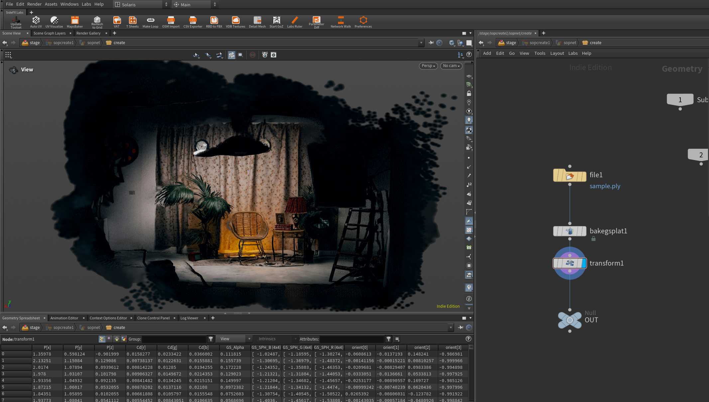

# sharp-to-3dgs

Converts [Apple's SHARP](https://github.com/apple/ml-sharp)-format `.ply` files into standard 3D Gaussian Splatting `.ply` format, compatible with Houdini's `bakegsplat` node.



## Requirements

- Python 3.x
- NumPy

## Usage

Place your SHARP `.ply` files in the `SHARP/` folder at the repo root, then run:

```bash
python convert_sharp_to_3dgs.py
```

Converted files are written to `SHARP_converted/`.

## Format Conversion

SHARP and standard 3DGS both use binary-little-endian PLY. The script remaps fields and zero-fills what's missing:

| Field | SHARP | 3DGS |
|---|---|---|
| `x y z` | ✓ | ✓ |
| `nx ny nz` | — | zero-filled |
| `f_dc_0/1/2` | ✓ | ✓ |
| `f_rest_0..44` (SH degree 1–3) | — | zero-filled |
| `opacity` | ✓ | ✓ |
| `scale_0/1/2` | ✓ | ✓ |
| `rot_0/1/2/3` | ✓ | ✓ |
| Camera metadata | ✓ (skipped) | — |

Zero-filled SH coefficients mean converted splats render with flat/diffuse color only — no view-dependent shading.


